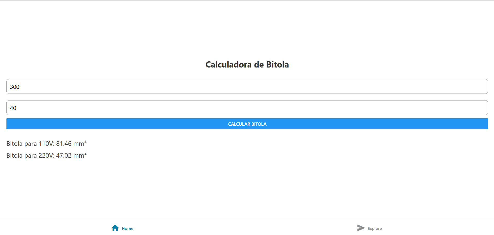

# 📱 Calculadora de Bitola Elétrica

Este projeto é um aplicativo desenvolvido em **React Native** com **Expo**, que calcula a **bitola adequada de fios elétricos** com base na **corrente elétrica (em ampères)** e na **distância (em metros)** informadas pelo usuário. O resultado apresenta a bitola recomendada para tensões de **110V** e **220V**.

---

## 🎯 Objetivo

Facilitar o dimensionamento de fios elétricos conforme normas de instalações, evitando sobreaquecimento e perdas elétricas. Este app é um exercício proposto pelo professor da disciplina de **Instalações Elétricas** para alunos do curso de **Desenvolvimento de Sistemas**.

---

## 📐 Fórmulas Utilizadas

- Para **110V**:
  \[
  \text{bitola110} = \frac{2 \times \text{corrente} \times \text{distância}}{294.64}
  \]

- Para **220V**:
  \[
  \text{bitola220} = \frac{2 \times \text{corrente} \times \text{distância}}{510.4}
  \]

Os valores são retornados em **milímetros quadrados (mm²)**.

---

## 💻 Tecnologias e Ferramentas

- [React Native](https://reactnative.dev/)
- [Expo](https://expo.dev/)
- [Visual Studio Code](https://code.visualstudio.com/)

---

## 📲 Como Executar o Projeto

### Pré-requisitos:
- Node.js instalado
- Expo CLI instalado globalmente:
  ```bash
  npm install -g expo-cli

## PRINT 
